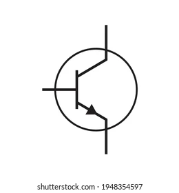

# Electronica Analogica.

## __-Resistencias Fijas:__

                                                     

 

### __Como funciona:__ 
Funciona convirtiendo la energía eléctrica en calor a través de la colisión de los electrones con los átomos del material.

### __Para que sirve:__ 
Sirven para limitar la corriente eléctrica y proteger componentes electrónicos, como los LED de daños.

### __Como lo usamos en clase:__ 
En clase las usamos para hacer montajes simples como el encendido de un diodo led.

## __-Resistencias Variables:__

 

                                                     

 
 
 

      

### __Como funciona:__ 
Las resistencias variables funcionan modificando el valor de resistencia de un circuito

### __Para que sirve:__ 
Sirven para controlar la intensidad de brillo de una lamapara, la velocidad de giro de un motor o el volumen de un altavoz...

### __Como lo usamos en clase:__ 
En clase aun no lo hemos utilizado.

## __-Condensadores:__
 

  

 

  

### __Como funciona:__ 
Funciona alamcenando la energia electrica.

### __Para que sirve:__ 
Sirve para almacenar energía en forma de campo eléctrico y liberarla rápidamente cuando se necesita.

### __Como lo usamos en clase:__ 
Uan no lo hemos utilizado en clase

## __-Diodo:__

 

  

 

  

### __Como funciona:__ 
Funciona permitiedo pasar los electrones en un sentido y no en el otro sentido.

### __Para que sirve:__ 
Sirven para controlar la cantidad de electrones que pasa por un circuito y evitar cortocircuito.

### __Como lo usamos en clase:__ 
No lo hemos usado en clase.

## __-Diodos LED:__

 

  

 

  

### __Como funciona:__ 
Un diodo LED funciona como un diodo normal al permitir el paso de la corriente eléctrica en una sola dirección.

### __Para que sirve:__ 
Sirve como indicador visual de colores.

### __Como lo usamos en clase:__ 
Lo usamos para hacer circuitos basico en clase

## __-Transitores:__
 

  

 

  

### __Como funciona:__ 
Funcionan como interruptores o amplificadores de señales eléctricas.
### __Para que sirve:__ 
Sirven para amplificar o conmutar señales eléctricas, actuando como interruptores electrónicos que controlan el flujo de corriente en un circuito.
### __Como lo usamos en clase:__ 

No lo hemos utilizado.

## __-Rele:__

 

  

 

  

### __Como funciona:__ 

### __Para que sirve:__ 

### __Como lo usamos en clase:__ 

# Circuitos de funcionamiento

## _Encendido de led con un transitor:_

 

  

### Funcionamineto:    
-En este circuito estamos usando una pila de 4,5 voltios, un led, dos ressistencias una de 200 amperios y otra de 1800 amperios, un pulsador, un transitor NPN y un condensador poliradizado.

-El funcionamineto del circuito es que cuando alguien mantiene pulsado el pulsador permite que circule corriente por la base del transitor haciendo que se encienda el led y que el condensador almacene energia, una vez el pulsador deja de ser pulsado el led va perdiendo su luz y no se apaga instantaneo esto es porque el condensador sigue teniendo energia de antes y la va perdiendo poco a poco haciendo que aun pase por la base del transitor y le llegue al led que va a estar perdiendo intensidad hasta que el condensador se quede sin energia.

## _Cambio de sentido de un motor mediante un rele:_

  

### Funcionamineto:
-En este circuito estamos usando dos pilas una de 6 voltios y otra de 9 voltios, un LDR, un potenciometro, una resitencia, un transitor NPN, un diono un rele y un motor.

-El funcionamiento del circuito es que cuando el circuito se pone en marcha el motor esta funcionando dando vueltas en un sentido, cuando incide luz sobre el LDR la resisitencia disminuye haciendo que pase por la base del transitor y el diodo controle el exceso de corriente que se  produce al desacticarse el rele y el motor gira hacia el otro sentido.

# Electronica Digital.

La electronica digital se basa en el empleo de componenetes que solo admiten dos estados: abiertos o cerrado, apagado o encendido, 0 o 1.

## _-Las puertas logicas:_
Las puertas logicas son componenetes capaces de realizar operaciones sencillas con ceros y unos.

Las puertas logicas mas importantes son las las  __NOT__, __OR__, __AND__, __NOR__, __NAND__ Y __OR exclusiva__.

Cada una de las puertas logicas tiene su __tabla de verdad__ que es una tabla en donde se pone los valores de de 0 o 1 y dependiendo de que puerta usemos nos saldra un valor diferente.

## __-NOT(NO):__

|       Simbolo            |       Disposición interna  |
| -------------            |      -------------         |
|                         |                          |

### Función:                                                                                                             

__Negación.__ La salida es la inversa de la entrada. Así, si entra un 1, sale un 0, y viceversa

### Tabla de verdad:

|       a       |       S       |
| ------------- | ------------- |
|       0       |       1       |
|       1       |       0       |

## __-AND(Y):__
### Simbolo:
  

### Función:                                                                                                             

__Conjunción.__ La salida es 1 solo cuando las dos entradas adoptan el valor 1. Es decir, tiene que darse una __y__ otra.

### Tabla de verdad:

|      a       |       b        |       S       |
| -----------  |    ---------   |  -----------  |
|      0       |       0        |       0       |
|      0       |       1        |       0       |
|      1       |       0        |       0       |
|      1       |       1        |       1       |

## __-OR(O):__
|       Simbolo            |       Disposición interna  |
| -------------            |      -------------         |
|                         |                          |

### Función:                                                                                                             

__Disyunción.__ La salida es 1 caundo vale 1 cualquiera de sus entradas o ambas. Se dan asi una __u__ otra __o__ ambas.

### Tabla de verdad:

|      a       |       b        |       S       |
| -----------  |    ---------   |  -----------  |
|      0       |       0        |       0       |
|      0       |       1        |       1       |
|      1       |       0        |       1       |
|      1       |       1        |       1       |

## __-XOR(O exclusiva):__

|       Simbolo            |       Disposición interna  |
| -------------            |      -------------         |
|                         |                          |

### Función:                                                                                                             

__Disyunción exclusiva.__ La salida es 1 cuando cualquiera de las entradas es 1, pero no ambas a la vez. O sea, se da, __o bien__ una, __o bien__ la otra.

### Tabla de verdad:

|      a       |       b        |       S       |
| -----------  |    ---------   |  -----------  |
|      0       |       0        |       0       |
|      0       |       1        |       1       |
|      1       |       0        |       1       |
|      1       |       1        |       0       |

## __-NOR(O negada):__

|       Simbolo            |       Disposición interna  |
| -------------            |      -------------         |
|                         |                          |

### Función:                                                                                                             

La salida es 1 solo cuando las dos entradas valen 0.

### Tabla de verdad:

|      a       |       b        |       S       |
| -----------  |    ---------   |  -----------  |
|      0       |       0        |       1       |
|      0       |       1        |       0       |
|      1       |       0        |       0       |
|      1       |       1        |       0       |

## __-NAND(Y negada):__

|       Simbolo            |       Disposición interna  |
| -------------            |      -------------         |
|                         |                          |

### Función:                                                                                                             

La salida solo vale 0 cuando ambas  entradas toman valor1.

### Tabla de verdad:

|      a       |       b        |       S       |
| -----------  |    ---------   |  -----------  |
|      0       |       0        |       1       |
|      0       |       1        |       0       |
|      1       |       0        |       0       |
|      1       |       1        |       0       |

## _-Simplificacion de circuitos:_

para simplificar circuitos nosotros usamos el __álgebra de Boole__.

Hay que saber que cuando un numero es 0 (cerrado) a la entrada se le denomina con su letra y elevado a un menos.

Si el numero de la entra es 1(abierto) la entra se deja igual con su letra.

|      a       |       b        |       c       |      S      | 
| -----------  |    ---------   |  -----------  | ----------- |
|      0       |       0        |       0       |      0      |
|      0       |       0        |       1       |      0      |
|      0       |       1        |       0       |      0      |
|      0       |       1        |       1       |      0      |
|      1       |       0        |       0       |    __1__    |
|      1       |       0        |       1       |      0      |
|      1       |       1        |       0       |    __1__    | 
|      1       |       1        |       1       |    __1__    |

__2.__ Se extraen las entradas en las que las salidas son positivas como una expresion logica.

S= ab-c- + abc- + abc

__3.__ Se simplifica empleando el __álgebra de Boole__

__S__= ab-c- + abc- + abc=

   a(b-c- + bc- + bc)=

   a(b-c- + bc- + bc- + bc)=

   a((b- + b) c- + b (c- + c))=

   a(1c- + 1b)=

   a(c- + b)=

  El circuito resultante es:  __a(b + c-)__

# Circuito encendido de led con puerta logicas.

 

  

### Función:  

# Circuito encendido de led con puerta logicas.

