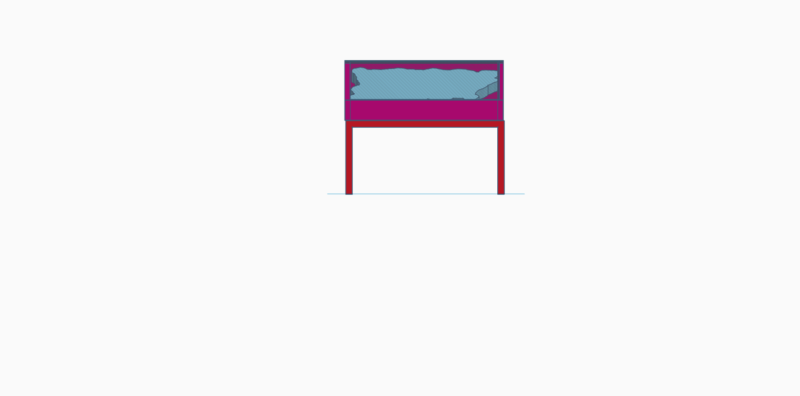
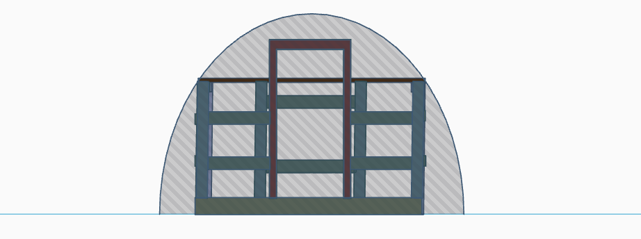
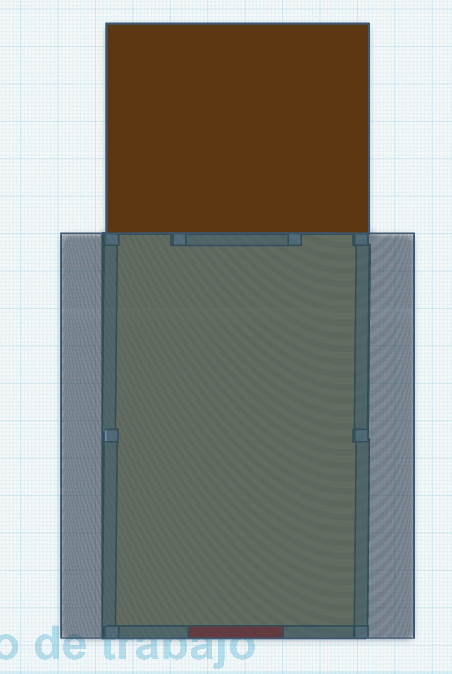

# Tecnología
## Cuaderno de tecnología 25-26 4ºESO

## __1º Proyecto (Mapa Jaen)__

__Mi diseño del soporte para el mapa:__

     

(El objetivo de este proyecto es crear un soprte con el menor gasto posible para exponer de forma permanente el mapa de Jaén actualmente guardado en el aula de tecnologia.)

# __Mi propuesta:__
-Tenemos un mapa de 1,52 m de largo y 1,12 m de ancho, lo que nos han encomendado es usar unas mesas del centro que ya no estan en un eso,
las mesas mas grandes son de 1,60 m de largo y 80 cm de ancho, aqui tenemos el primer problema y es que el largo es perfecto para el mapa pero el ancho es demasiado pequeño por lo que la idea principal es usar dos mesas grandes, por lo que las medidas seria de 1,60 m de largo y 1,60 m de ancho seria un cuadrado perfecto.

-El segundo paso es que quieren que el mapa se vea inclinado para una buena exposición al publico,
por lo que nuestra idea es reutilizar 2 soprtes de metal que se usan para sujetar muebles poniendolos cada uno en cada lado del mapa para que haya un grado de inclinación pero no excesivo.

-No queremos que con la inclinación se vea la parte de abajo del mapa por eso con con unas tablas de madreras pintadas de unos 10 cm de alto lo pondriamos poner alrededor del mapa atornillados.

 __Imagenes de tinkercad:__

     

 

 __Presupuesto para el mapa:__

-Mesas: Gratis

-Tablas de madera: Gratis

-Barra de metal: Gratis

-Metacrilato: 100$-160$ (Pacoprint.com)

-Tornillos: Gratis

 __Planificación:__

## __2º Proyecto (Invernadero)__

__Mi diseño del ivernadero:__

(El objetivo es remodelar el invernadero para volver a ponerlo en marcha despues de 5 años)

                  

Del exterior del invernadero lo mas importante a cambiar es el plastico ya lleva 5 años puesto y esta fatal habria que sustituirlo por uno nuevo, enfrente podemos ver la puerta del invernadero que esta caida, lo primero seria arreglar el suelo de la puerta para que haya soporte y despues volver a atornillar la puerta a la estructura para que haya un buen soporte, en la parte de atras del invernadero vamos areconstruirlo como estaba antes en un lateral tenemos una barra de metal que esta conectado con el invernadero en la parte de la izquierda vamos a hacer lo mismo con la misma barra de metal la vamos a poner en el lado una parte atornillada al invernadero y la otra la pegaremos al suelo con cemento y por ultimo una vez terminado la parte de atras entre las barras de metal pondremos una lona y se quedaria como un patio.

      

Lo primero que me gustaria remodelar del interior seria el suelo porque de tanto tiempo hay esta desgastado, roto e inestables.
El suelo lo quitaria y le pondria otro del mismo material (madera aglomerada). 
El hierro que hace de soporte para el plastico ya esta oxidado hay que cambiarlo por unos nuevo.
Muchas de las maderas que hacen de soporte en el invernadero estan desgastadas y dobladas podiendo causar algun accidente tambien hay que cambiarlo.

 __Imagenes de tinkercad:__

       

__Presupuesto para el invernadero:__

Madera aglomerada:

Lona de plástico: 20-30€

Tablas de madera: Gratis

Rejillas de metal:

Lona: 5-10€

