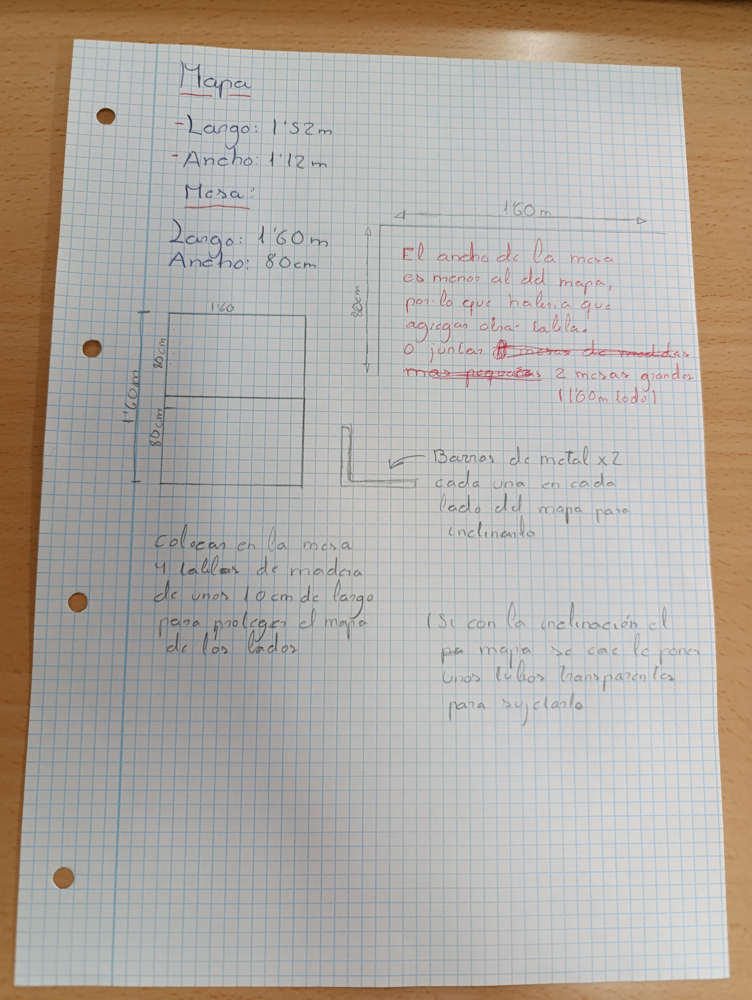
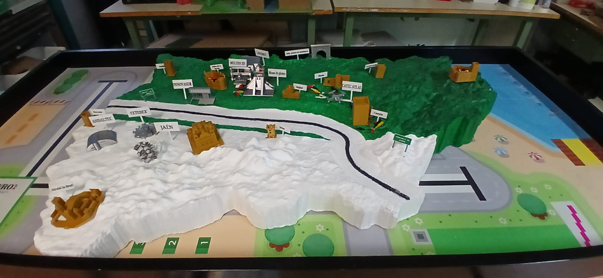
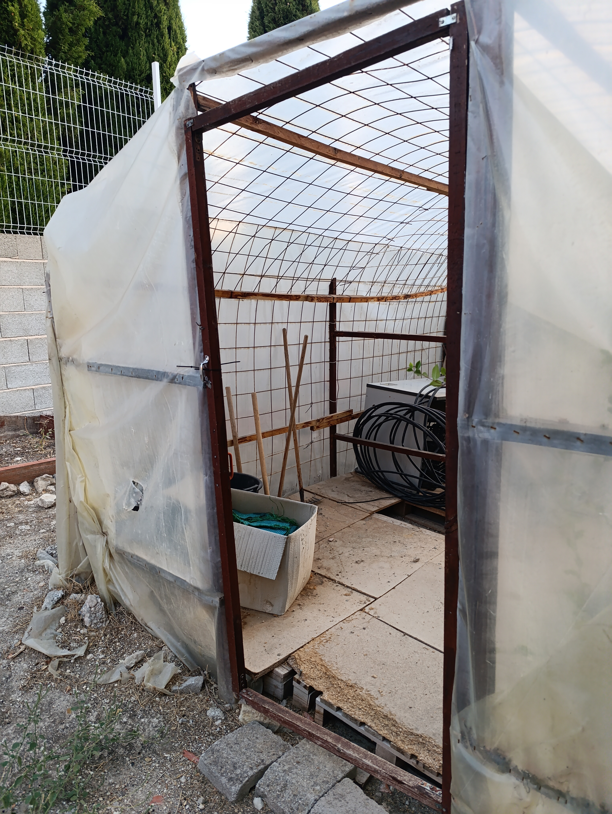
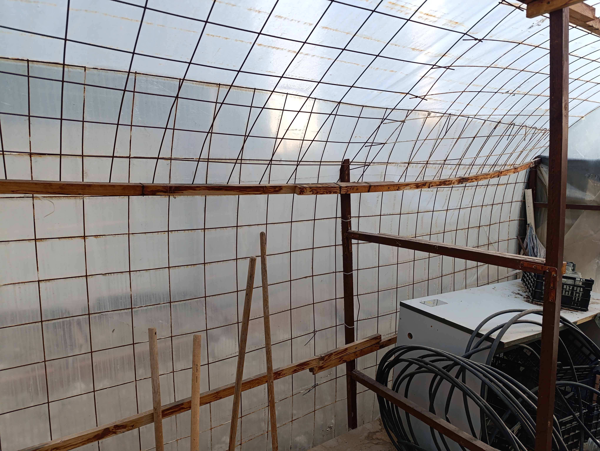

# Tecnología
## Cuaderno de tecnología 25-26 4ºESO

## __1º Proyecto (Mapa Jaen)__

__Mi diseño del soporte para el mapa:__

     

(El objetivo de este proyecto es crear un soprte con el menor gasto posible para exponer de forma permanente el mapa de Jaén actualmente guardado en el aula de tecnologia.)

# __Mi propuesta:__
-Tenemos un mapa de 1,52 m de largo y 1,12 m de ancho, lo que nos han encomendado es usar unas mesas del centro que ya no estan en un eso,
las mesas mas grandes son de 1,60 m de largo y 80 cm de ancho, aqui tenemos el primer problema y es que el largo es perfecto para el mapa pero el ancho es demasiado pequeño por lo que la idea principal es usar dos mesas grandes, por lo que las medidas seria de 1,60 m de largo y 1,60 m de ancho seria un cuadrado perfecto.

-El segundo paso es que quieren que el mapa se vea inclinado para una buena exposición al publico,
por lo que nuestra idea es reutilizar 2 soprtes de metal que se usan para sujetar muebles poniendolos cada uno en cada lado del mapa para que haya un grado de inclinación pero no excesivo.

-No queremos que con la inclinación se vea la parte de abajo del mapa por eso con con unas tablas de madreras pintadas de unos 10 cm de alto lo pondriamos poner alrededor del mapa atornillados.

 __Imagenes de tinkercad:__
 
 __Presupuesto para el mapa:__

-Mesas: Gratis

-Tablas de madera: Gratis

-Barra de metal: Gratis

-Metacrilato:

-Tornillos: Gratis

## __2º Proyecto (Invernadero)__

__Mi diseño del ivernadero:__

                  

      

