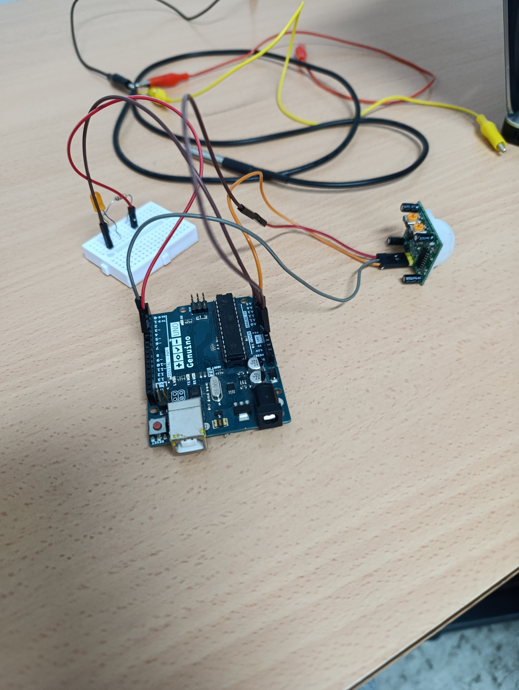
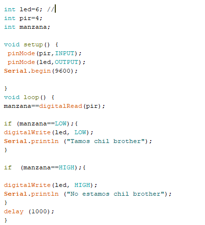
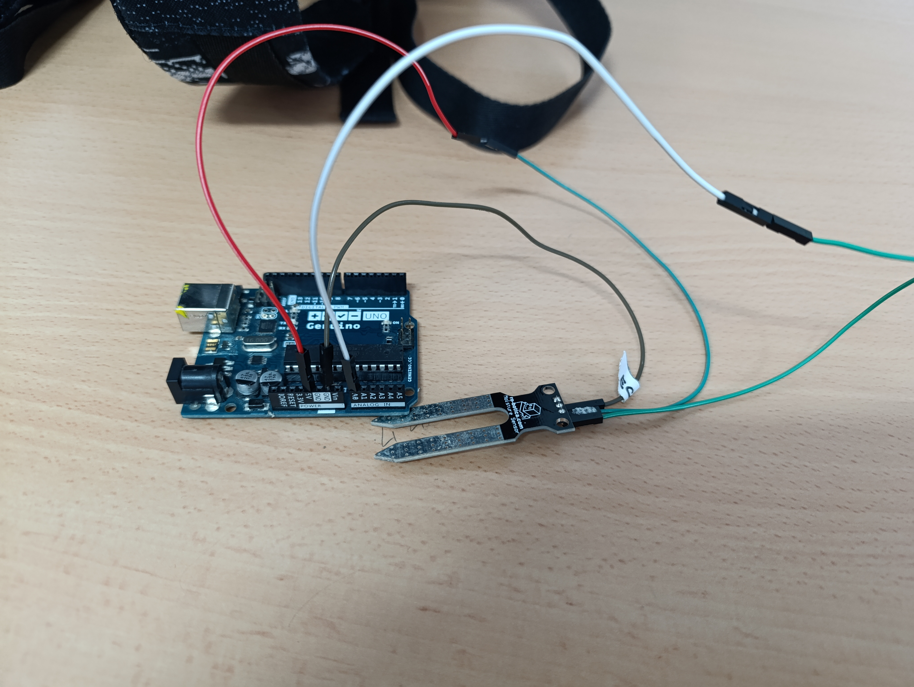
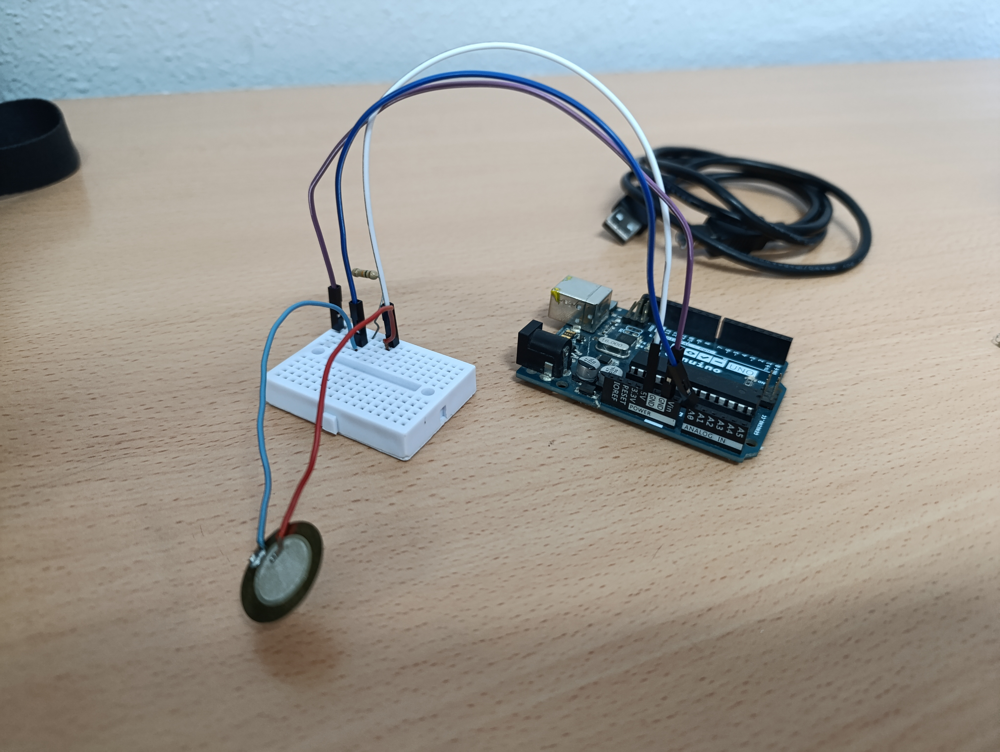
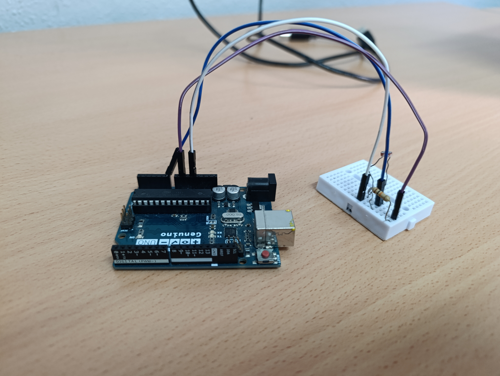
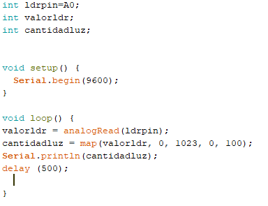
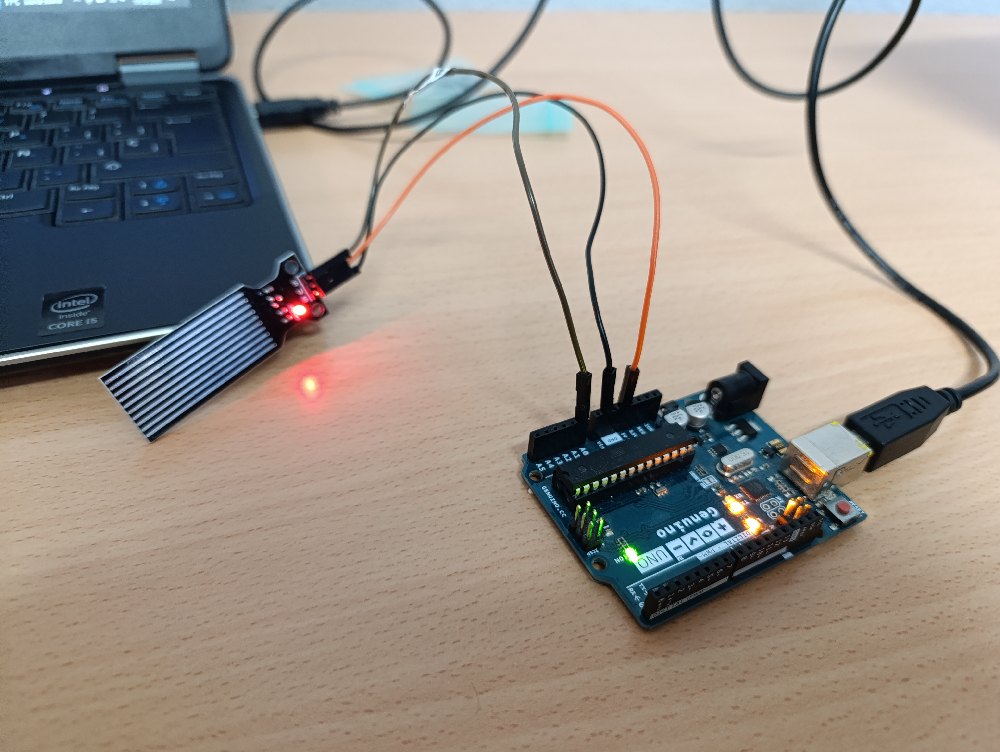
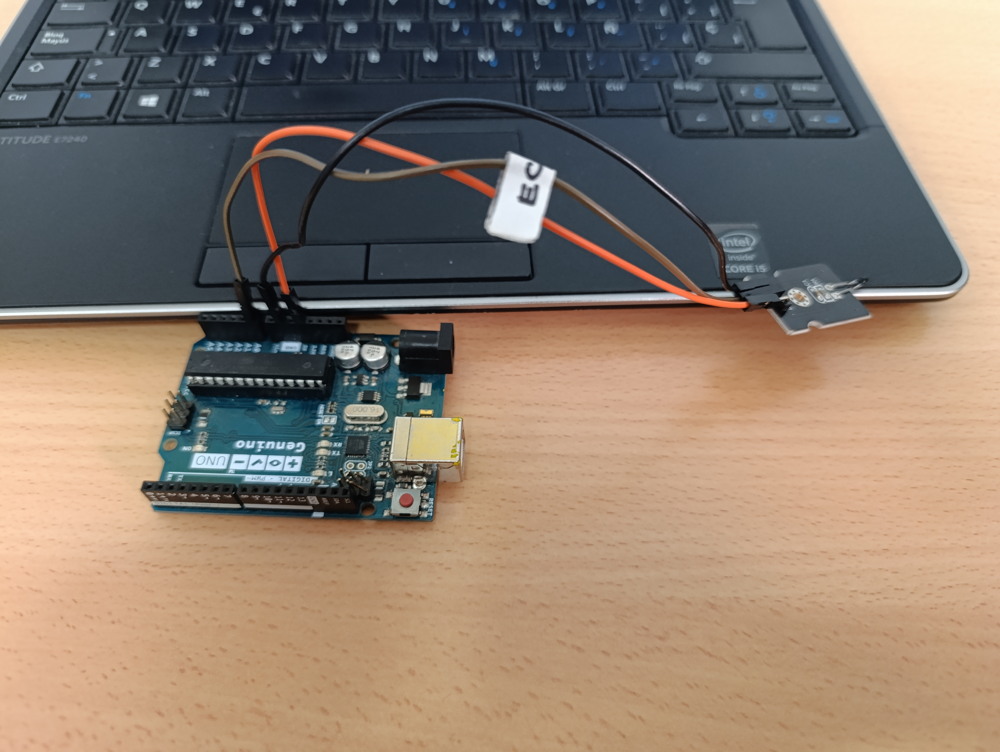

## -Sensor PIR

|       Montaje            |       Programa  |
| -------------            |      -------------         |
|                         |                          |

## -Sensor de humedad

|       Montaje            |       Programa  |
| -------------            |      -------------         |
|                         |                          |

|       Video              |     
|     -------------        |      
|                          |   

### -Objetivo: 
El objetivo de este programa es que el sensor de humedad detecte la humedad de donde lo pongamos en nuestro caso detectar la humedad de la tierra.

### -Programa:
Al empezar este programa creamos 2 variables una con __int__ llamada __sensor__ que es la que se va a referir al sensor de huemedad y otra variable __float__ que la usamos para mostrar numeros con decimales llamada __temperatura__.

En el __void setup__ unicamente indicamos la velocidad de transmision de datos a __9600__.

En el __void loop__ de primeras indicamos que nuestra variable llamada __sensor__ esta conectado al pin __A0__ de nuestra placa de arduinos y por ultimo indicamos con el __Serial.println__ que el valor que nos de en el sensor se pueda ver en el monitor serie.

## -Sensor de presión

|       Montaje            |       Programa  |
| -------------            |      -------------         |
|                         |                          |

### -Funcionamiento del sensor:
Sirve para detectar una presión cual a detectar una mínima presión envíe la información a la placa y así la placa con esa información haga una cosa o otra. Pero su función es enviar la información a la placa.

### -Objetivo:
El objetivo es implantarlo en el invernadero (en la entrada) para saber si alguien ha entrado o no.

### -Explicación del programa:

## -Sensor LDR

|       Montaje            |       Programa  |
| -------------            |      -------------         |
|                         |                          |

### -Funcionamiento del sensor:
 Sirve para saber cuánta luminosidad detecta y la intensidad de la luz.

### -Objetivo:
El objetivo es implantarlo en el invernadero para saber cuando le está dando sol y cuando no.

### -Explicación del programa:

## -Sensor de agua

|       Montaje            |       Programa  |
| -------------            |      -------------         |
|                         |                          |

### -Funcionamiento del sensor:
El sensor de agua lo que hace es que cuando nosotros lo metemos en agua podamos ver la cantidad de agua que hay en el recipiente que sea.

### -Objetivo:
Nuestro objetivo con este sensor es implantarlo en nuestro invernadero
para ver.

### -Explicación del programa:

##  -Sensor de temperatura

|       Montaje            |       Programa  |
| -------------            |      -------------         |
|                         |                          |

###  -Funcionamiento del sensor:
Un sensor de temperatura lineal sirve para detectar aumentos de temperatura.

### -Objetivo:
El objetivo es implantarlo en el invernadero para saber la temperatura que hace dentro o si hay algún incendio.

### -Explicación del programa:

