## -Sensor PIR

|       Montaje            |       Programa  |
| -------------            |      -------------         |
|                         |      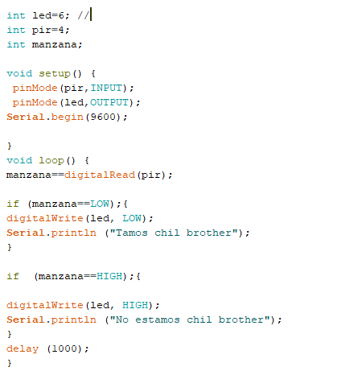                    |

## -Sensor de humedad

|       Montaje            |       Programa  |
| -------------            |      -------------         |
|      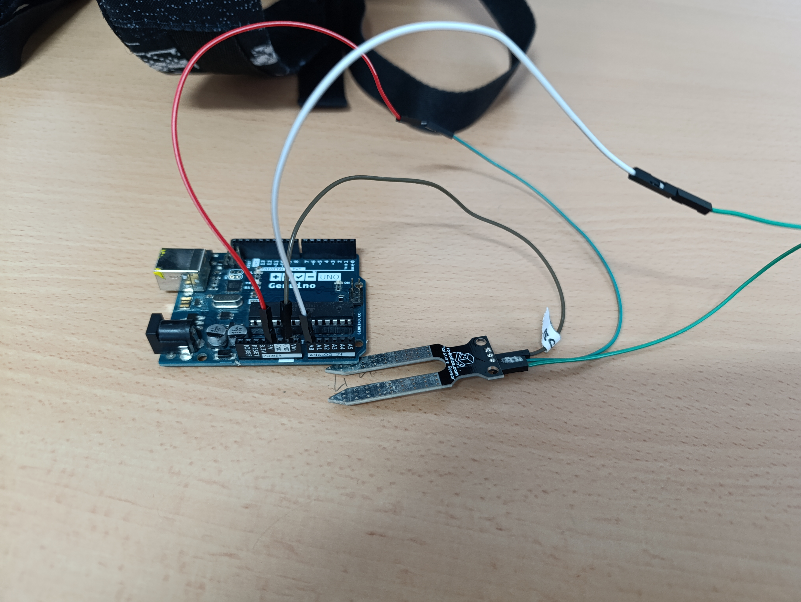                   |                          |

|       Video              |     
|     -------------        |      
|                          |   

### -Objetivo: 
El objetivo de este programa es que el sensor de humedad detecte la humedad de donde lo pongamos en nuestro caso detectar la humedad de la tierra.

### -Programa:
Al empezar este programa creamos 2 variables una con __int__ llamada __sensor__ que es la que se va a referir al sensor de huemedad y otra variable __float__ que la usamos para mostrar numeros con decimales llamada __temperatura__.

En el __void setup__ unicamente indicamos la velocidad de transmision de datos a __9600__.

En el __void loop__ de primeras indicamos que nuestra variable llamada __sensor__ esta conectado al pin __A0__ de nuestra placa de arduinos y por ultimo indicamos con el __Serial.println__ que el valor que nos de en el sensor se pueda ver en el monitor serie.

## -Sensor de presión

|       Montaje            |       Programa  |
| -------------            |      -------------         |
|      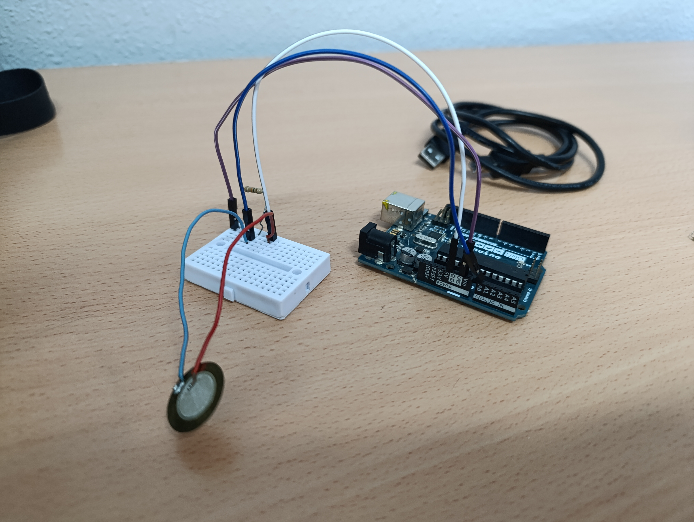                   |                          |

### -Funcionamiento del sensor:
Sirve para detectar una presión cual a detectar una mínima presión envíe la información a la placa y así la placa con esa información haga una cosa o otra. Pero su función es enviar la información a la placa.

### -Objetivo:
El objetivo es implantarlo en el invernadero (en la entrada) para saber si alguien ha entrado o no.

### -Explicación del programa:

 |       Explicación del programa              |     
|     -------------        |      
|        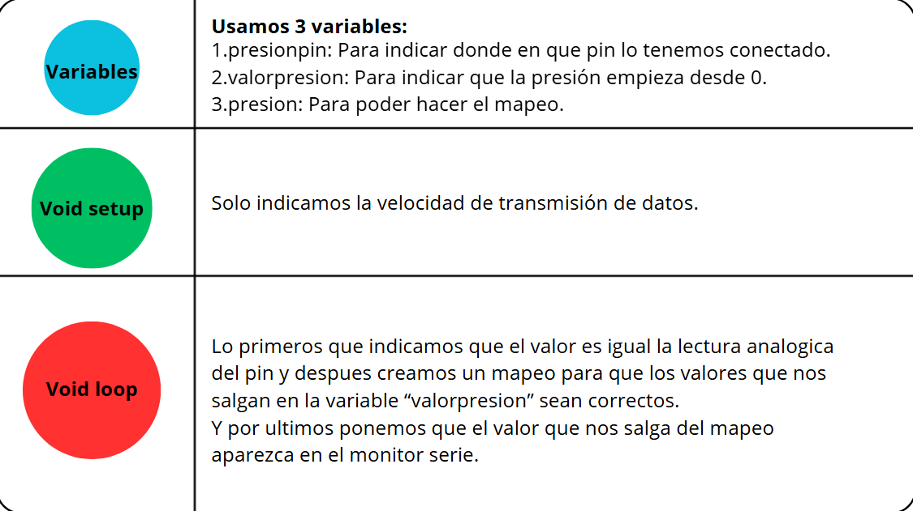               |   

## -Sensor LDR

|       Montaje            |       Programa  |
| -------------            |      -------------         |
|      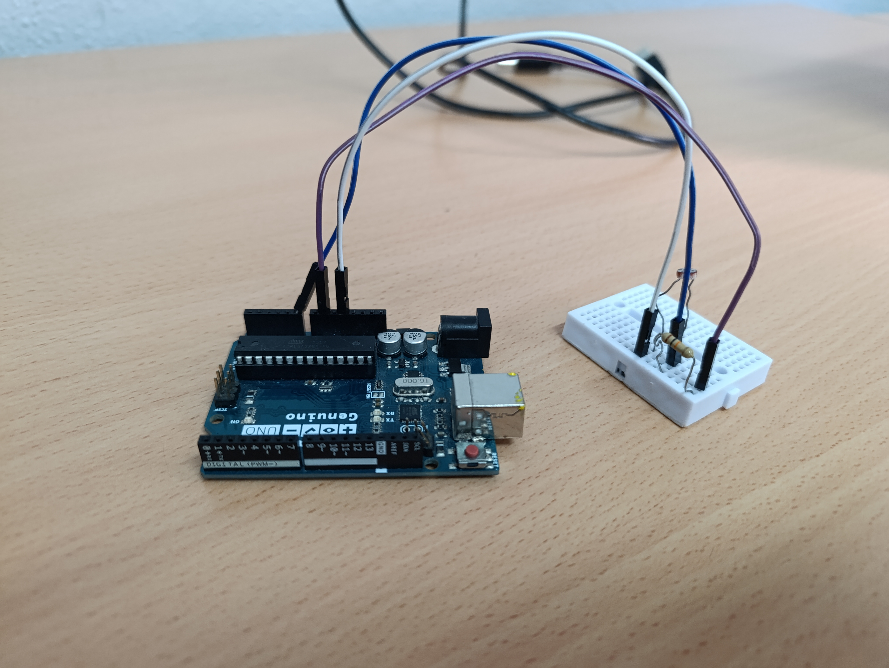                   |      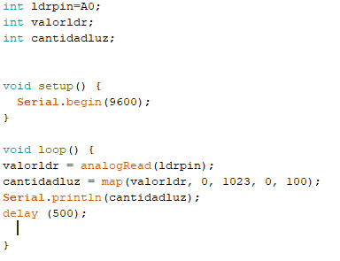                    |

### -Funcionamiento del sensor:
 Sirve para saber cuánta luminosidad detecta y la intensidad de la luz.

### -Objetivo:
El objetivo es implantarlo en el invernadero para saber cuando le está dando sol y cuando no.

### -Explicación del programa:
 
 |       Explicación del programa              |     
|     -------------        |      
|                       |   

## -Sensor de agua

|       Montaje            |       Programa  |
| -------------            |      -------------         |
|      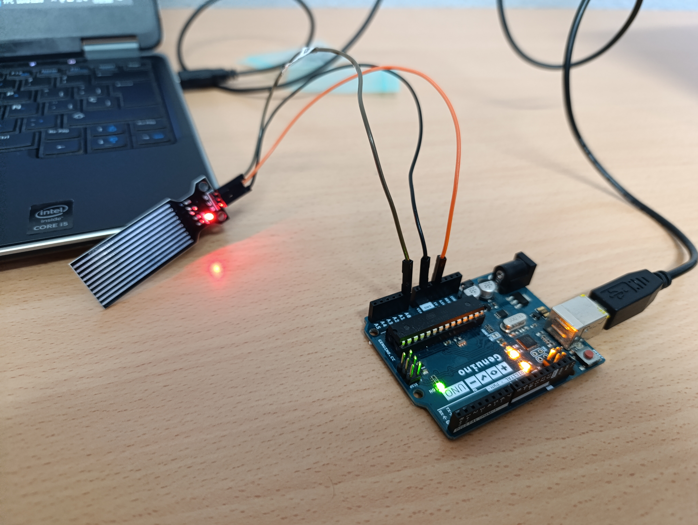                   |                          |

### -Funcionamiento del sensor:
El sensor de agua lo que hace es que cuando nosotros lo metemos en agua podamos ver la cantidad de agua que hay en el recipiente que sea.

### -Objetivo:
Nuestro objetivo con este sensor es implantarlo en nuestro invernadero
para ver.

### -Explicación del programa:

 |       Explicación del programa              |     
|     -------------        |      
|        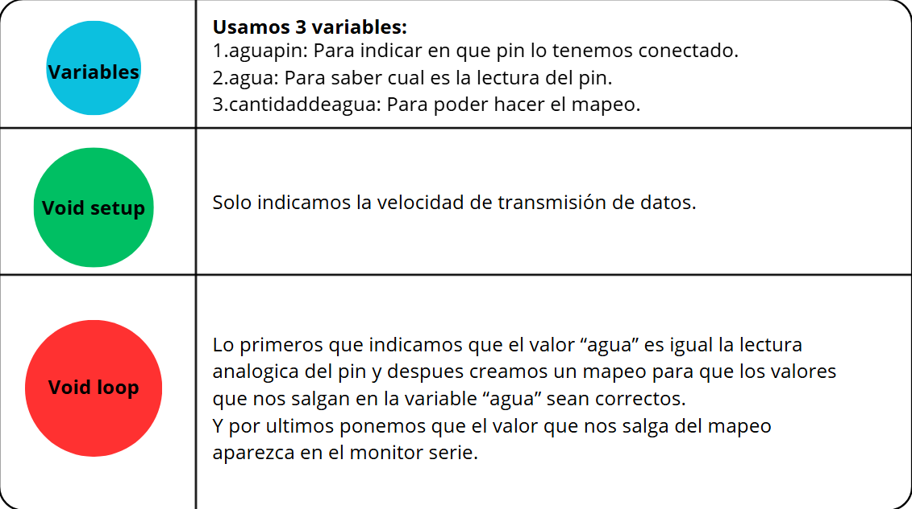               |   

##  -Sensor de temperatura

|       Montaje            |       Programa  |
| -------------            |      -------------         |
|      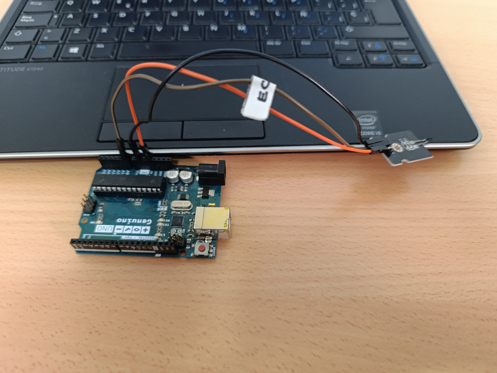                   |                          |

###  -Funcionamiento del sensor:
Un sensor de temperatura lineal sirve para detectar aumentos de temperatura.

### -Objetivo:
El objetivo es implantarlo en el invernadero para saber la temperatura que hace dentro o si hay algún incendio.

### -Explicación del programa:

 |       Explicación del programa              |     
|     -------------        |      
|                       |   

# -Montaje 3D Del invernadero.

Despues de haber trabajo con todos los sensores anteriores ahora ponemos en marcha un invernadero montado en 3D para poder poner aprueba todos los sensores.

## -Vigas del invernadero.

## -Suelo del invernadero.

|       Montaje 3D           |       Montaje real  |
| -------------            |      -------------         |
|                         |                          |

  
-Hemos tenido que diseñar 12 plataformas en las que se cuentan cada fila del 1-4 y cada fila siendo A,B,C,D, en las que nos lo hemos dividido entre el grupo.

Cada plataforma tiene una medida de ancho y de largo de 15cm (150cm en tinkerkad). 

El montaje funciona mediante viseras y entradas para poder unir las pltaformas de una forma sencilla. En el caso de 1A (la esquina) en el lado derecho tiene una visera para que encaje con el 2A que tiene un entrada y en la parte delantera de 1A tenemos otra visera para que pueda encajar con el 1B y asi con todas las demas piezas para que todas encajen correctamente y que no se muevan. 

A la vez cada plataforma tiene tiene un hueco para que podamos encajar las vigas y este todo conectado para que podamos cojerlo y que no se desmonte. 

## -Montaje final del invernadero 3D.

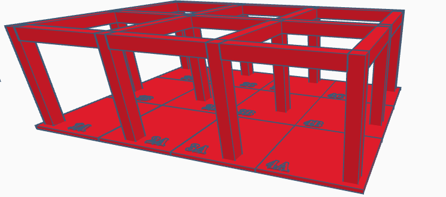 
  

  Este es el montaje final de todo el invernadero diseñado en 3D.

## -Montaje final del invernadero real.

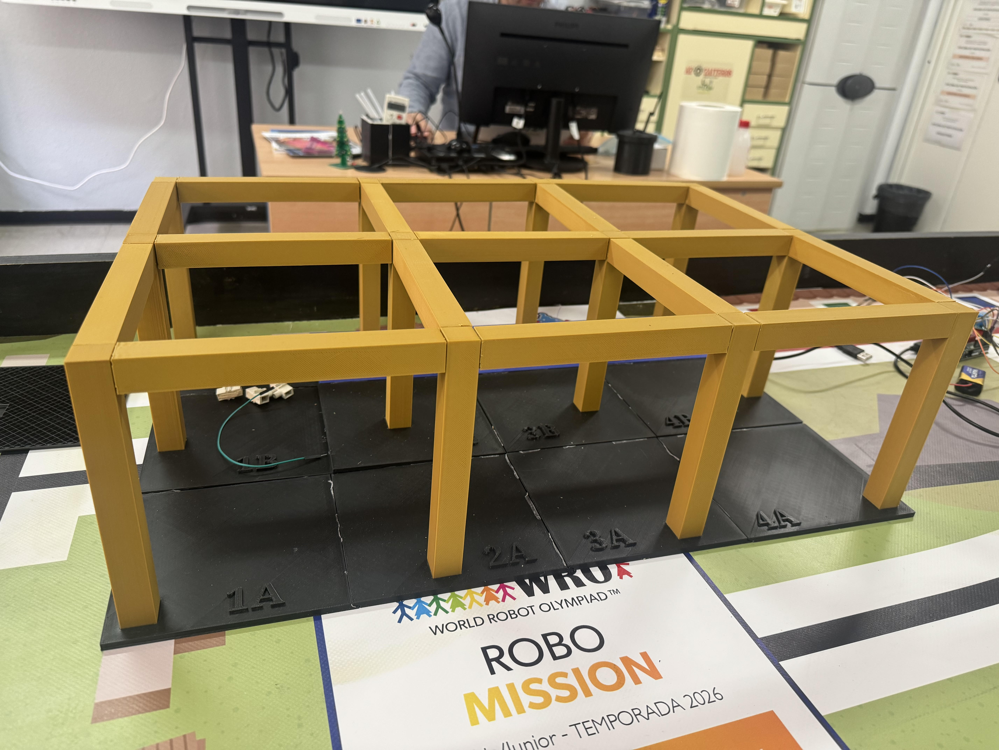 
  

 Este es el montaje final de todo el invernadero diseñado.

## -Montaje de los sensores.

## -Programación de los sensores.

     

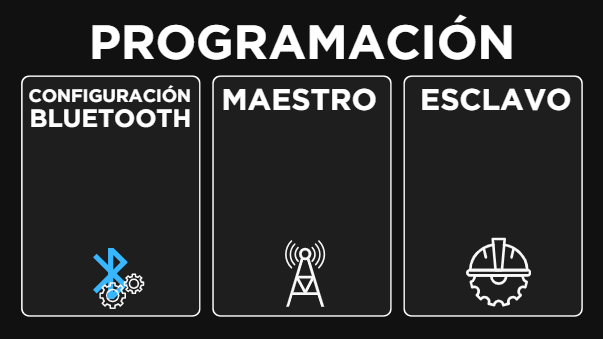 
  

### CÓDIGO CONFIGURACIÓN MÓDULO BLUETOOTH MEDIANTE EL MODO AT:

 

  Este es el programa que se utiliza para configurar los __modulos BLUETOOTH__ de __maestro__ y __esclavo__, mediante el modo __AT__.
  
  -Para poder programar el programa primero tenemos que añadir su biblioteca correspondiente en este caso __#include <SoftwareSerial.h>__

  -Usando la biblioteca creamos un variable que la llamamos __miBT__ ___(SoftwareSerial miBT(10, 11); // RX, TX)___ que la usamos para definir en que pines tenemos conectado el __modulo bluetooht__.

__Void setup__:

  -Configuramos la velocidad del ordenador a __9600 budios__ ___(Serial.begin(9600))___.
  
  -La velocidad del __modulo bluetooth__ a __38400__ ___(miBT.begin(38400))___ para poder hacer la configuración con el modo __AT__.

  -Usamos el ___(Serial.println)___ para poder escribir dentro del monitor serie  y poder configurar los __modulos bluetooth__.

__Void loop__:

  -Si el **modulo bluetooth** esta dispnible _**if (miBT.available())**_  mandamos una señal del **bleutooth** al **monitor serie**
  _**Serial.write(miBT.read());**_.

  -Con este es lo mismo pero al reves si el **monitor serie** esta disponible _**if (Serial.available())**_ mandamos una señal del **monitor serie** al  **bleutooth**.

### -Configuración mediante el modo AT :

Tanto para maestro como para esclavo hay que conectar la patilla **"EN"** o **"KEY"** del **módulo HC-05** a **5V**, un a vez hecho, se deja presionado el botón reset y se conecta Arduino por USB al ordenador desde el que vamos a hacer la configuración. Acto seguido se escribe lo siguiente en el **Monitor Serie**:

**ESCLAVO**:

**AT**: Mandamos el codigo **AT** y nos tiene que responder con un **ok** esto significa que funciona.

**AT+ROLE=0**: Este codigo forzamos a nuestro **modulo bluetooth** a que se comporte como el **esclavo** ya que le hemos puesto que va a ser el numero **0**.

**AT+ADDR?**: Le pedimos que nos de su  clave **MAC** para nosotros despues poder poner esa clave en nuestro esclavo y que esten conectados entre si.

**MAESTRO**:

**AT**

**AT+ROLE=1**

**AT+BIND= "escribir directamente la dirección MAC del esclavo" (sustituir los ":" por ",")**

  

  

