## -Sensor PIR

|       Montaje            |       Programa  |
| -------------            |      -------------         |
|      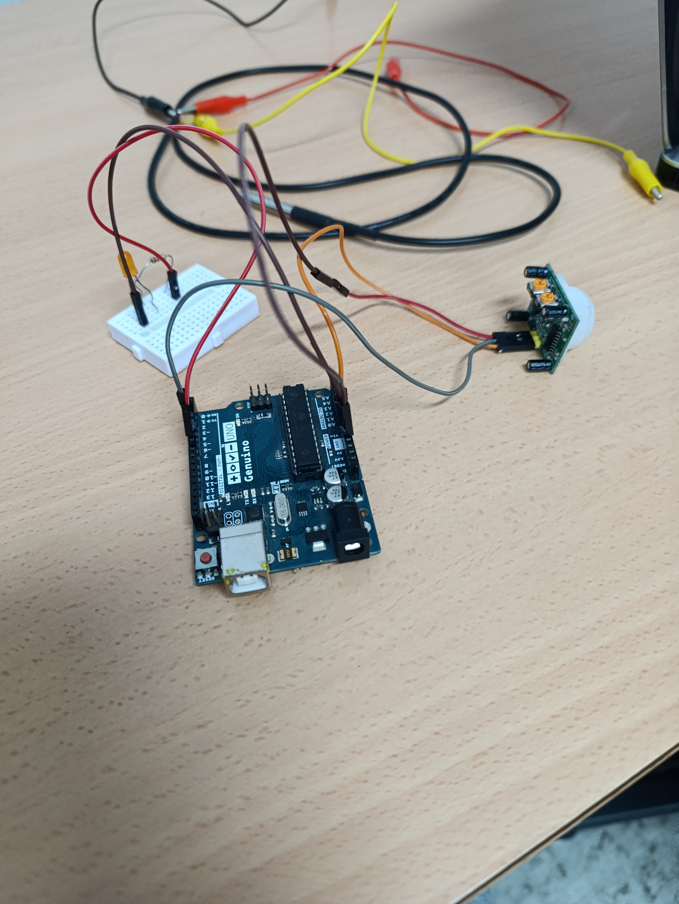                   |      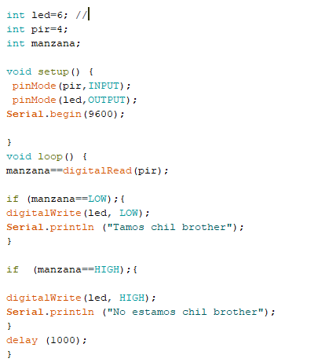                    |

## -Sensor de humedad

|       Montaje            |       Programa  |
| -------------            |      -------------         |
|      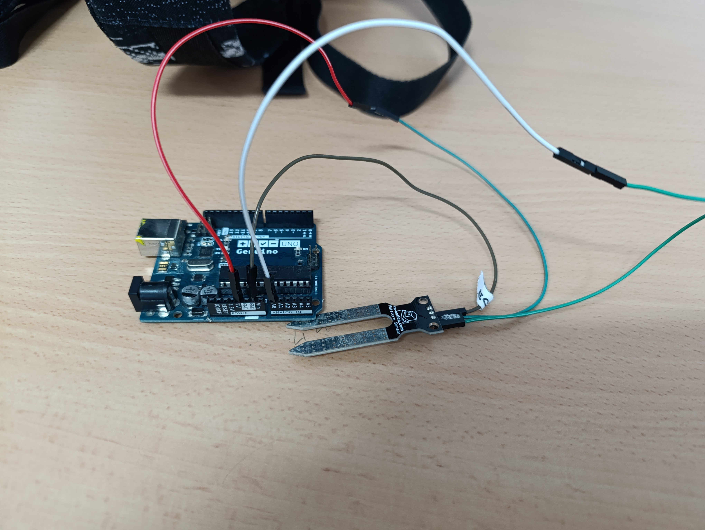                   |                          |

|       Video              |     
|     -------------        |      
|                          |   

### -Objetivo: 
El objetivo de este programa es que el sensor de humedad detecte la humedad de donde lo pongamos en nuestro caso detectar la humedad de la tierra.

### -Programa:
Al empezar este programa creamos 2 variables una con __int__ llamada __sensor__ que es la que se va a referir al sensor de huemedad y otra variable __float__ que la usamos para mostrar numeros con decimales llamada __temperatura__.

En el __void setup__ unicamente indicamos la velocidad de transmision de datos a __9600__.

En el __void loop__ de primeras indicamos que nuestra variable llamada __sensor__ esta conectado al pin __A0__ de nuestra placa de arduinos y por ultimo indicamos con el __Serial.println__ que el valor que nos de en el sensor se pueda ver en el monitor serie.

## -Sensor de presión

|       Montaje            |       Programa  |
| -------------            |      -------------         |
|      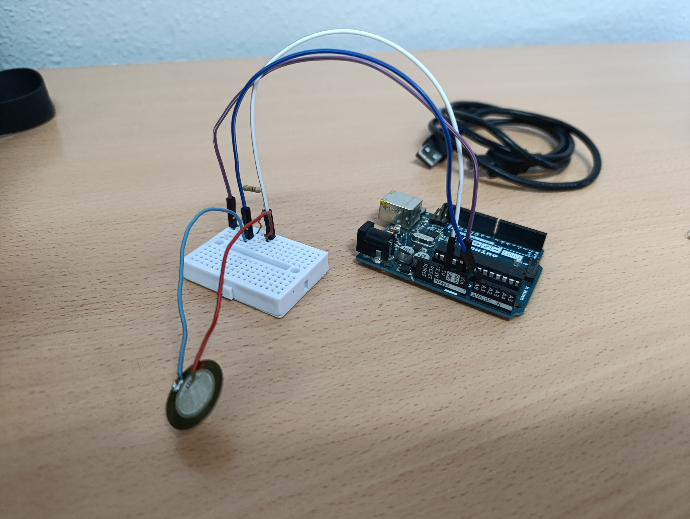                   |                          |

### -Funcionamiento del sensor:
Sirve para detectar una presión cual a detectar una mínima presión envíe la información a la placa y así la placa con esa información haga una cosa o otra. Pero su función es enviar la información a la placa.

### -Objetivo:
El objetivo es implantarlo en el invernadero (en la entrada) para saber si alguien ha entrado o no.

### -Explicación del programa:

 |       Explicación del programa              |     
|     -------------        |      
|        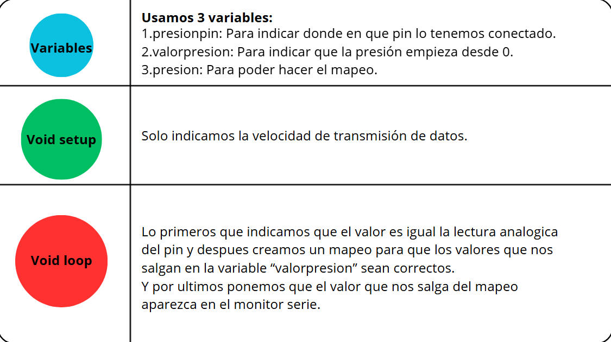               |   

## -Sensor LDR

|       Montaje            |       Programa  |
| -------------            |      -------------         |
|      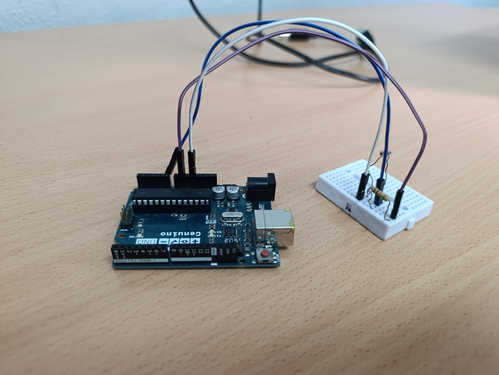                   |      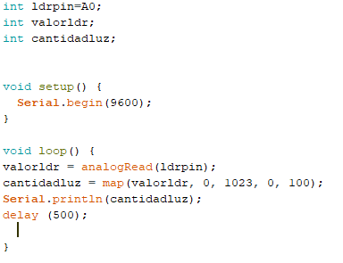                    |

### -Funcionamiento del sensor:
 Sirve para saber cuánta luminosidad detecta y la intensidad de la luz.

### -Objetivo:
El objetivo es implantarlo en el invernadero para saber cuando le está dando sol y cuando no.

### -Explicación del programa:
 
 |       Explicación del programa              |     
|     -------------        |      
|                       |   

## -Sensor de agua

|       Montaje            |       Programa  |
| -------------            |      -------------         |
|      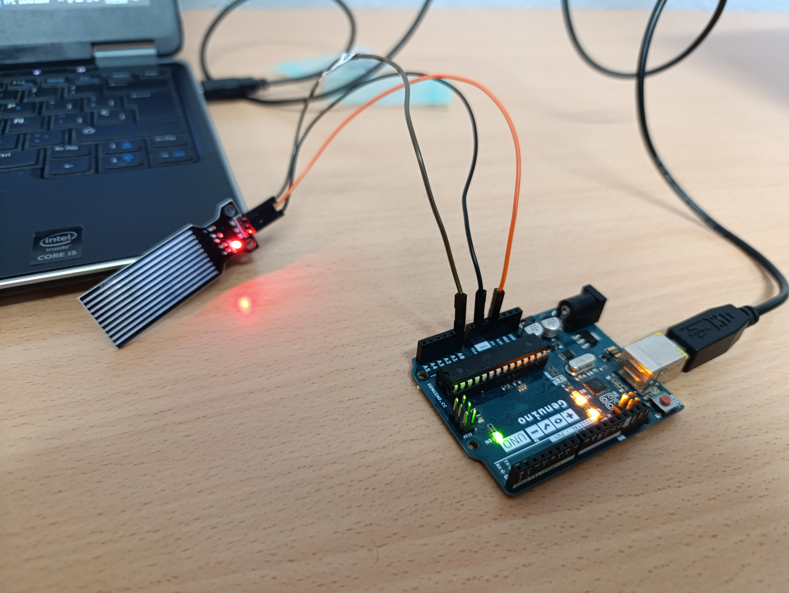                   |                          |

### -Funcionamiento del sensor:
El sensor de agua lo que hace es que cuando nosotros lo metemos en agua podamos ver la cantidad de agua que hay en el recipiente que sea.

### -Objetivo:
Nuestro objetivo con este sensor es implantarlo en nuestro invernadero
para ver.

### -Explicación del programa:

 |       Explicación del programa              |     
|     -------------        |      
|        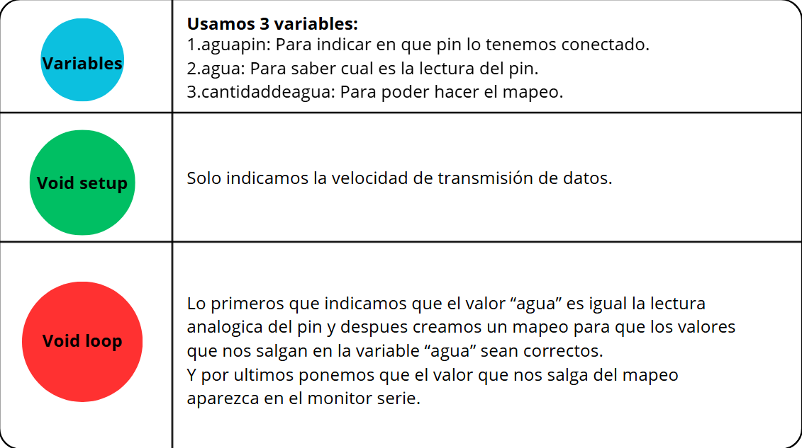               |   

##  -Sensor de temperatura

|       Montaje            |       Programa  |
| -------------            |      -------------         |
|      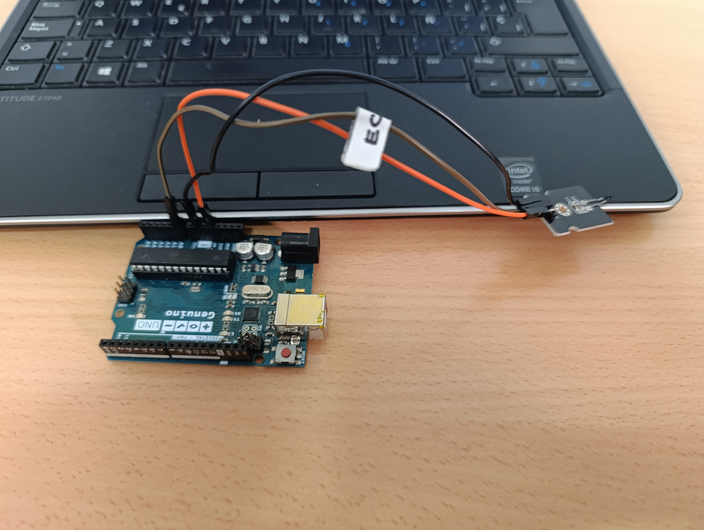                   |                          |

###  -Funcionamiento del sensor:
Un sensor de temperatura lineal sirve para detectar aumentos de temperatura.

### -Objetivo:
El objetivo es implantarlo en el invernadero para saber la temperatura que hace dentro o si hay algún incendio.

### -Explicación del programa:

 |       Explicación del programa              |     
|     -------------        |      
|                       |   

# -Montaje 3D Del invernadero.

Despues de haber trabajo con todos los sensores anteriores ahora ponemos en marcha un invernadero montado en 3D para poder poner aprueba todos los sensores.

## -Vigas del invernadero.

## -Suelo del invernadero.

|       Montaje 3D           |       Montaje real  |
| -------------            |      -------------         |
|                         |                          |

  
-Hemos tenido que diseñar 12 plataformas en las que se cuentan cada fila del 1-4 y cada fila siendo A,B,C,D, en las que nos lo hemos dividido entre el grupo.

Cada plataforma tiene una medida de ancho y de largo de 15cm (150cm en tinkerkad). 

El montaje funciona mediante viseras y entradas para poder unir las pltaformas de una forma sencilla. En el caso de 1A (la esquina) en el lado derecho tiene una visera para que encaje con el 2A que tiene un entrada y en la parte delantera de 1A tenemos otra visera para que pueda encajar con el 1B y asi con todas las demas piezas para que todas encajen correctamente y que no se muevan. 

A la vez cada plataforma tiene tiene un hueco para que podamos encajar las vigas y este todo conectado para que podamos cojerlo y que no se desmonte. 

## -Montaje final del invernadero 3D.

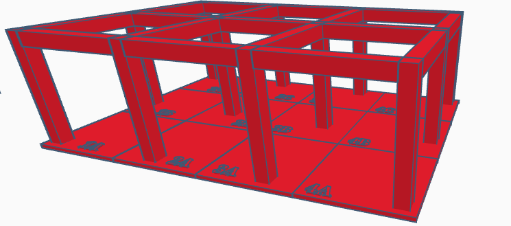 
  

  Este es el montaje final de todo el invernadero diseñado en 3D.

## -Montaje final del invernadero real.

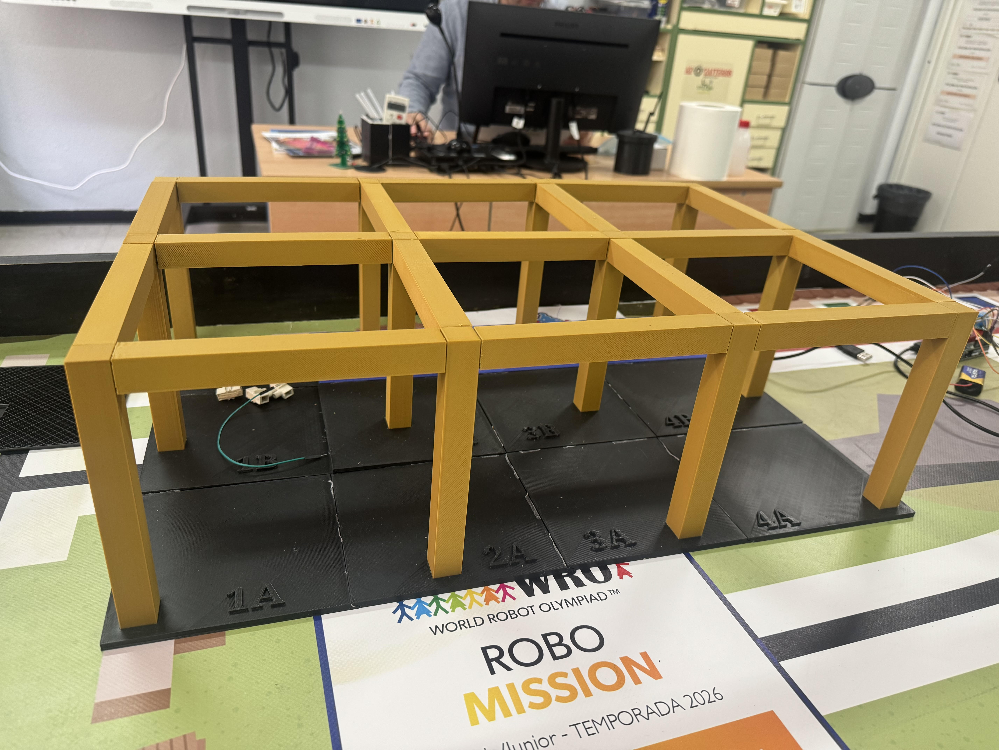 
  

 Este es el montaje final de todo el invernadero diseñado.

## -Montaje de los sensores.

## -Programación de los sensores.

     

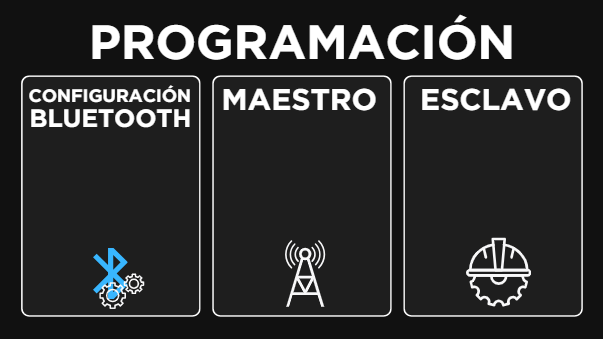 
  

## -CÓDIGO CONFIGURACIÓN MÓDULO BLUETOOTH MEDIANTE EL MODO AT:

 

  Este es el programa que se utiliza para configurar los __modulos BLUETOOTH__ de __maestro__ y __esclavo__, mediante el modo __AT__.
  
  -Para poder programar el programa primero tenemos que añadir su biblioteca correspondiente en este caso __#include <SoftwareSerial.h>__

  -Usando la biblioteca creamos un variable que la llamamos __miBT__ ___(SoftwareSerial miBT(10, 11); // RX, TX)___ que la usamos para definir en que pines tenemos conectado el __modulo bluetooht__.

__Void setup__:

  -Configuramos la velocidad del ordenador a __9600 budios__ ___(Serial.begin(9600))___.
  
  -La velocidad del __modulo bluetooth__ a __38400__ ___(miBT.begin(38400))___ para poder hacer la configuración con el modo __AT__.

  -Usamos el ___(Serial.println)___ para poder escribir dentro del monitor serie  y poder configurar los __modulos bluetooth__.

__Void loop__:

  -Si el **modulo bluetooth** esta dispnible _**if (miBT.available())**_  mandamos una señal del **bleutooth** al **monitor serie**
  _**Serial.write(miBT.read());**_.

  -Con este es lo mismo pero al reves si el **monitor serie** esta disponible _**if (Serial.available())**_ mandamos una señal del **monitor serie** al  **bleutooth**.

### -Configuración mediante el modo AT :

Tanto para maestro como para esclavo hay que conectar la patilla **"EN"** o **"KEY"** del **módulo HC-05** a **5V**, un a vez hecho, se deja presionado el botón reset y se conecta Arduino por USB al ordenador desde el que vamos a hacer la configuración. Acto seguido se escribe lo siguiente en el **Monitor Serie**:

**-ESCLAVO**:

**AT**: Mandamos el codigo **AT** y nos tiene que responder con un **ok** esto significa que funciona.

**AT+ROLE=0**: Este codigo forzamos a nuestro **modulo bluetooth** a que se comporte como el **esclavo** ya que le hemos puesto que va a ser el numero **0**.

**AT+ADDR?**: Le pedimos que nos de su  clave **MAC** para nosotros despues poder poner esa clave en nuestro esclavo y que esten conectados entre si.

**-MAESTRO**:

**AT**: Mandamos el codigo **AT** y nos tiene que responder con un **ok** esto significa que funciona.

**AT+ROLE=1**:  Este codigo forzamos a nuestro **modulo bluetooth** a que se comporte como el **maestro** ya que le hemos puesto que va a ser el numero **1**. 

**AT+BIND= "escribir directamente la dirección MAC del esclavo" (sustituir los ":" por ",")**: Ponemos ese codigo y despues del igual ponemos la clave **MAC** que nos dio el esclavo, asi ya estan los dos conectados entre si.

  

## -CÓDIGO MAESTRO:

  

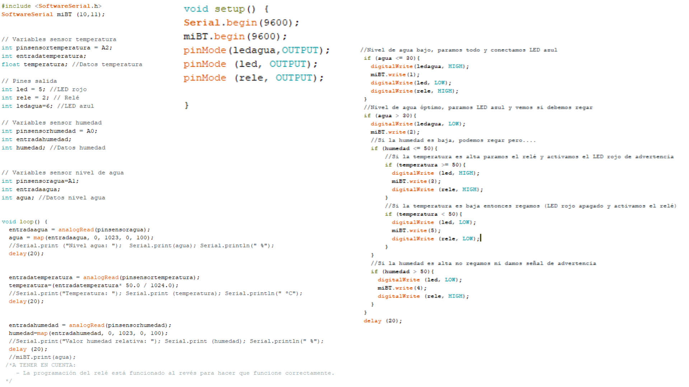 

### Variables:

-Usando la biblioteca creamos un variable que la llamamos __miBT__ ___(SoftwareSerial miBT(10, 11); // RX, TX)___ que la usamos para definir en que pines tenemos conectado el __modulo bluetooht__.

 ### -Variables sensor temperatura:

__El valor total que va a tener la temperatura = A2;__: El pin en el que esta conectado en la placa de arduinos.

__entradatemperatura;__: El valor total que va a tener la temperatura.

__temperatura;__: Variable creada para poder hacer el mapeo.

### -Variables sensor humedad:

**int pinsensorhumedad = A0;** :  El pin en el que esta conectado en la placa de arduinos.

**int entradahumedad;** : El valor total que va a tener de la humedad.

**int humedad;** : Variable creada para poder hacer el mapeo.

### -Pines salida:

**int led = 5;** : El pin en el que esta conectado el led rojo en la placa de arduinos.

**int rele = 2;** : El pin en el que esta conectado el rele en la placa de arduinos.

**int ledagua=6;** : El pin en el que esta conectado el led azul en la placa de arduinos.

### -Variables sensor nivel de agua:

**int pinsensoragua=A1;** : El pin en el que esta conectado en la placa de arduinos.

**int entradaagua;** : El valor total que va a tener de la humedad.

**int agua;** : Variable creada para poder hacer el mapeo.

__Void setup__:

Ponemos que la velocidad del ordenador y del bluetooth sean de **9600 baudios**.

Y los 3 pines que hemos puesto que van a ser de salida les ponemos el programa **pinMode(ledagua,OUTPUT);**, y asi con los otros dos.

**Void loop**:

Al iniciar creamos 3 mapeos (**agua, temperatura, humedad**):

**Agua:**

Primeros empezamos diciendo que nuestra variiable llamada **entradaagua** va a ser igual al pin analogico **analogRead(pinsensoragua);** , y despues indicamos que la variable creada para el mapeo llamada **agua** va a tener el mismo valor que el mapeo que se haga **agua = map(entradaagua, 0, 1023, 0, 100);**  en donde hacemos una regla de 3 para que los valores son salgan concordando al que haya.

**Temperatura:**

Es igual que el anterior pero en este caso es mapeo es diferente debido a que la temperatura no se mide como los demas.

**Humedad:**

Es igual que el del agua.

Ahora empezamos con toda la programación para que el montaje funcione.
 
Primero ponemos in condicional **"if"** si preguntamos si donde esta nuestro sensor hay menos 30% de agua **"if (agua <= 30)"** si lo hay pues encendemos el led azul **digitalWrite(ledagua, HIGH);** indicando que hay poca agua, seguidamente mandamos una señal bluetooth numerica con el nuemro 1 **miBT.write(1)** y aparagamos el led rojo de la temperatura y el rele porque no tenemos agua suficiente para regar.

**Nota: "el rele funciona al reves cuando pone high esta apagado y viceversa"**

Ahora si nuestro nivel de agua es mas del 30% **"if (agua > 30)"** , es este caso apagamos el led indicando que hay sificiente nivel de agua y mandamos otra señal bluetooth con el numero 2.

Si la humedad es menor o 50% podemos regar pero tenemos que comprobar si la temperatura es apta, por eso dentro de humedad creamos dos condionales de temperatura.

Uno si la temperatura el es mayor de 50% **if (humedad <= 50)** encendemos el led de la temperatura para indicar que hace mucha calor y no podemos regar, a su vez mandamos una señal bluetooth con el numero 3 y apagamos en rele.

Pero si la temperatura el menor del 50% **if (temperatura < 50)** apagamos el led de la temperatura indicando que no hace calor y podemos regar, a su vez enviamos una señal bluetooth con el numero 5 y encendemos el rele para poder regar.

Y por ultimo si la humedad es mayor al 50% **if (humedad > 50)** apagamos el led de temperatura, madamos una señal bluetooth con el numero 5señal bluetooth con el numero 4 y apagamos el rele.

## -CÓDIGO ESCLAVO:

  

 

### Variables:

-Usando la biblioteca creamos un variable que la llamamos __miBT__ ___(SoftwareSerial miBT(10, 11); // RX, TX)___ que la usamos para definir en que pines tenemos conectado el __modulo bluetooht__.

-Creamos dos variables mas una para el led del agua y otra para el led de la temeperatura.

__Void setup__:

Ponemos que la velocidad del ordenador y del bluetooth sean de **9600 baudios**.

Y ponemos los dos pines de salida **OUTPUT**.

**Void loop**:

Primero mediante un condicional decimos si el dispositivo bluetooth llamado **miBT** esta disponible, si si lo esta pues creamos una variable llamada dato que va a ser igual a la señal bluetooth que nos llegue **int dato = miBT.read** y abajo ponemos que ese dato se vea en el monitor serie para aseguararnos de que los numeros que nos lleguen sean los correctos.

Ya dependiendo de que numero nos llegue por bluetooth va a hacer una cosa diferente si nos llega el 1, el led de agua se enciende, si llegua el 2 led de agua se apagaa y asi con todos.

## -OBJETIVO DE DESARROLLO SOSTENIBLE (ODS):

  

 

En este trabajo nos hemos centrado en 3 ODS:

**N3 Salud y bienestar**: Gracias al invernadero inteligente todas las frutas y verduras plantadas en el van salir como un producto exelente sin necesidad de productos quimicos.

**N9 Industria, innovación y infraestructura**: El diseño de una nuava estructura

**N12 Producción y consumo responsable**: Gracias al invernadero inteligente podemos controlar el uso extremo de agua porque este sisteme nos indica caundo las plantas necesitan agua o no.
